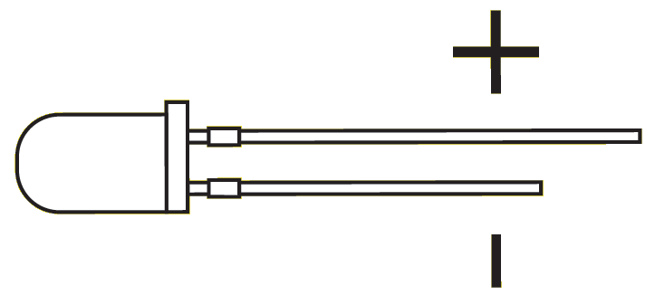

Hardware
========
Led aansluiten
--------------

De ledjes die wij gebruiken hebben twee pinnen, een korte en een lange. 
Voor tijdens het aansluiten moet je goed onthouden dat de lange pin **positief** is, en de korte **negatief**.

Daarnaast moeten we bij het aansluiten ook altijd een weerstand plaatsen tussen een van de pootjes van de led en de arduino.
Dit zorgt ervoor dat het ledje niet teveel stroom krijgt. 

Als je geen weerstand gebruikt dan is het mogelijk dat het lampje doorbrand en daardoor werkt hij niet meer!

Een ledje aansluiten
^^^^^^^^^^^^^^^^^^^^

Kun jij het volgende plaatje namaken?

Alle ledjes
^^^^^^^^^^^

Kun jij nu alle 5 de ledjes aansluiten? Zie hier een voorbeeld:

.. image:: imgs/arduino-led-full.png

Licht sensor aansluiten
-----------------------

De lichtsensor heeft net als de led twee pootjes. 
Hierbij maakt het echter niet uit hoe je hem aansluit, als het ene pootje maar negatief is, en de andere positief.

Je moet hierij wel opletten dat we een pin van de arduino gebruiken die **analoog** is.
We gebruiken namelijk een sensor, die we analoog gaan uitlezen.
Een lichtsensor is eigenlijk een variabele weerstand, hoe minder licht, hoe hoger de weerstand.

We gaan deze sensor uitlezen met de arduino, en hiermee weten we hoeveel licht de sensor ontvangt.

De analoge pinnen zijn hier te vinden:

Om de lichtsensor aan te sluiten moet je het volgende namaken:

Resultaat
---------

Om verder te kunnen met de software moet het er nu dus zo uit zien:

